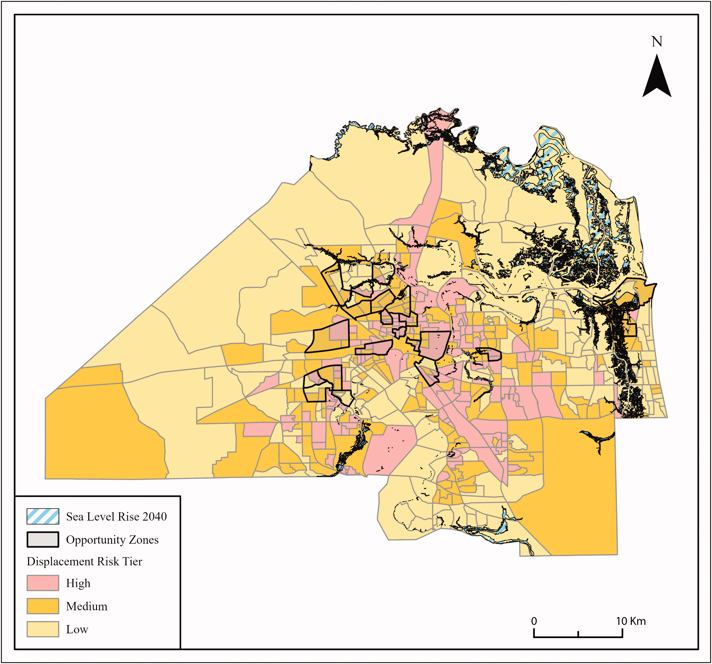
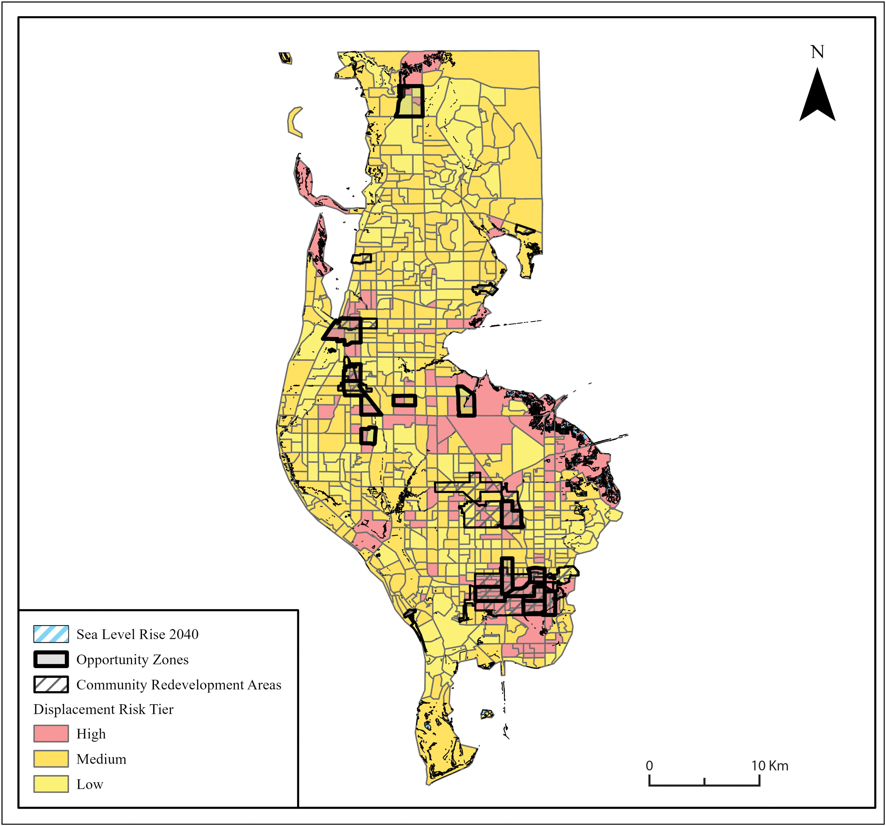
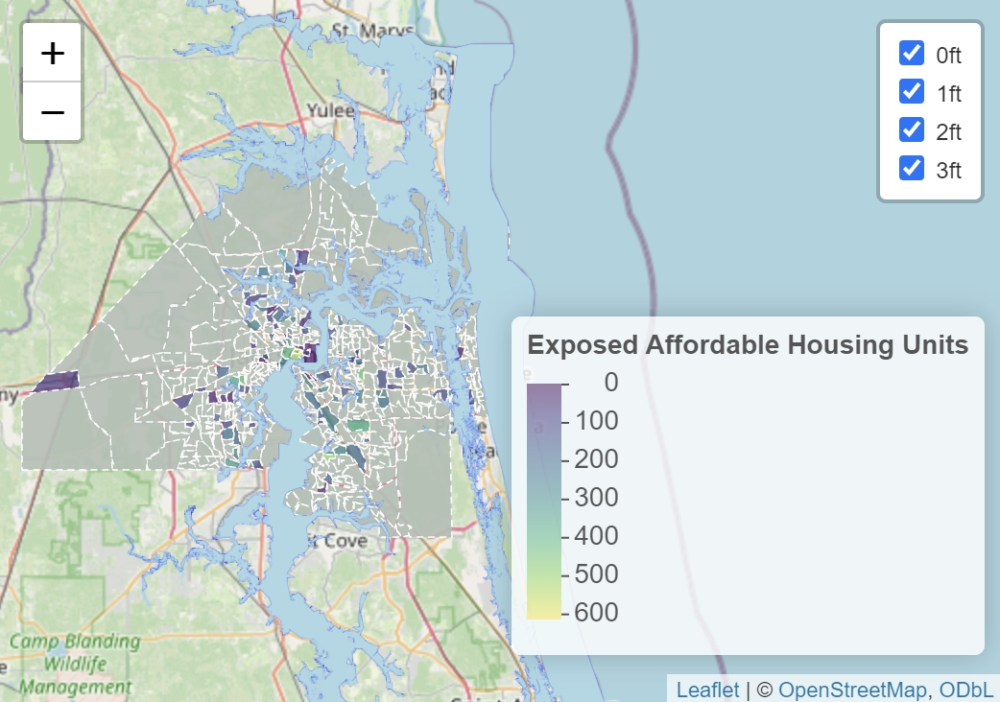
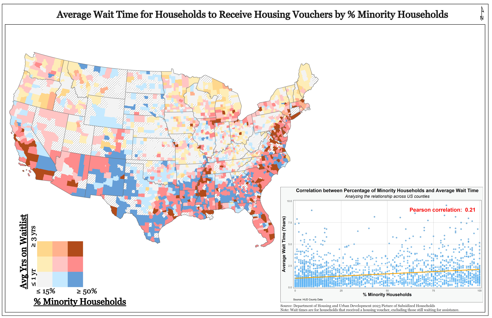

# Health Geographer and Population Researcher

[About Me](#about-me) | [Education](#education) | [Publications](#publications-and-reports) | [CAnD3 Showcase](#cAnD3-trainings-and-projects-showcase)

## About Me
As a health geographer and spatial data scientist, I am motivated to explore the relationships between geography, health, and society. I am fascinated by the social and physical environments that shape health and well being. 

By adopting a spatial perspective and utilizing a range of quantitative methods — from GIS techniques to Bayesian models to spatial and non-spatial statistics – my work advances the incorporation of the geographic perspective in population health research and contributes to understanding health disparities. My scholarly work encompasses a broad range of domains, including public health, the influence of neighborhoods on health, social determinants of health, climate change and health, and climate gentrification.

Currently, as a PhD candidate in the Geography Department at Florida State University my research has been broadly focused on investigating the impact of social and built environments on health and well-being (See my CV here: [CV](image/CV1.pdf)). This work has offered insights into the disparities in life expectancy linked to social determinant of health, the impact of COVID-19 on U.S. nursing homes, the implications of differential privacy on the calculation of small area health metrics, and the potential displacement risks in communities facing climate gentrification.

## Education 
- Ph.D. Candidate, Florida State University, 2019-Present
  Supervisor: Dr. Christopher K. Uejio

- M.S., GIS, Florida State University, 2018

- B.A., History, Columbus State University, 2016

## Research Interests
### Methods: 
- GIS
- Spatial Statistics
- Population Analytics

### Applications: 
- Public Health
- Neighborhoods and Health
- Social Determinants of Health
- Vulnerability and Climate Change

## Connect with Me

- [Google Scholar](https://scholar.google.com/citations?user=RJfxNTQAAAAJ&hl=en)
- [LinkedIn](https://www.linkedin.com/in/bertram-melix-672a12160/)

## Publications and Reports

### Publications:

·     Bertram L. Melix and Christopher K. Uejio. In Review. “Evaluating Small Area Differential Privacy Life Expectancy.” 

·     Wong, Sandy, C.S. Ponder, and Bertram Melix. 2023. “Spatial and Racial Covid-19 Disparities in U.S. Nursing Homes.” Social Science & Medicine. [Article](https://www.ncbi.nlm.nih.gov/pmc/articles/PMC10080861/) | [PDF](https://github.com/blm17e/Portfolio/blob/main/image/Spatial%20and%20racial%20covid-19%20disparities%20in%20U.S.%20nursing%20homes.pdf)

·     Bertram L. Melix, April Jackson, William Butler, Tisha Holmes, and Christopher K. Uejio. 2022. “Locating Neighborhood Displacement Risks to Gentrification Pressures in Three Coastal Counties in Florida.” The Professional Geographer. [Article](https://www.tandfonline.com/doi/abs/10.1080/00330124.2022.2087695) | [PDF](https://github.com/blm17e/Portfolio/blob/main/image/Locating%20Neighborhood%20Displacement%20Risks%20to%20Climate%20Gentrification%20Pressures%20in%20Three%20Coastal%20Counties%20in%20Florida.pdf)

·     Bertram L. Melix, Christopher K. Uejio, Kristina W. Kintziger, Keshia Reid, Chris Duclos, Melissa M. Jordan, Tisha Holmes, and Jessica Joiner. 2020. “Florida Neighborhood Analysis of Social Determinants and Their Relationship to Life Expectancy.” BMC Public Health. [Article](https://link-springer-com.proxy.lib.fsu.edu/content/pdf/10.1186/s12889-020-08754-x.pdf) | [PDF](https://github.com/blm17e/Portfolio/blob/main/image/Florida%20neighborhood%20analysis%20of%20social%20determinants%20and%20their%20relationship%20to%20life%20expectancy.pdf)

·     Rees, Amanda and Bertram Melix. 2019. “Landscape Discourses and Community Garden Design: Creating Community Gardens in One Mid-Sized Southern US City.” Studies in the History of Gardens & Designed Landscapes. [Article](https://www.tandfonline.com/doi/abs/10.1080/14601176.2018.1512797)

### Reports:

·     McCreary T, Miltonette C, Jackson A, Rose A, Melix B. 2023. Can 8 Wait? A Review of Use of Force Policies in Florida and Perspectives on their Effectiveness. Leroy Collins Institute at Florida State University. [Report](https://lci.fsu.edu/wp-content/uploads/2023/06/22-LCI-011-Can-8-Wait-Full-Report_V3.pdf)

·     Butler W, Holmes T, Jackson A, Lange Z, Melix B, Milordis A. 2022. Addressing climate driven displacement: planning for sea level rise in Florida’s coastal communities and affordable housing in inland communities in the face of climate gentrification. Florida State University. [Report](https://lci.fsu.edu//wp-content/uploads/sites/28/2022/02/Butler-Jackson-Holmes-et-al.-2021-Final-LCI-Report-Climate-Gentrification-Updated-min.pdf)

·     Amy Khare, Leila Fiester, Sherise McKinney, Alexandra Curley, April Jackson, and Bertram L. Melix. 2022. “From the Ground Up: Housing as a Catalyst for Community-Driven Redevelopment of Chicago’s Majority-Black Woodlawn Neighborhood.” National Initiative on Mixed-Income Communities (NIMC). [Report](https://www.poah.org/sites/default/files/related-files/From_the_ground_up_brief.pdf)

## Example Projects

### Locating Neighborhood Displacement Risks to Climate Gentrification Pressures in Three Coastal Counties in Florida
#### Highlights
·    Over the next few decades, residents in vulnerable communities may be subject to second-order displacement, via in-movers pricing longtime residents out of their homes and neighborhoods.

·    Areas that have the highest risk of gentrification-driven displacement based on demographic, socioeconomic, and housing factors tend to be inland in Florida.

·    This study uses the well-known principal components analysis (PCA) to create synthetic displacement factors to construct an index to categorize neighborhoods as being at potentially high, medium, or low risk for second-order displacement.

#### Figures

## CAnD3 Trainings and Projects Showcase

### Example #1: CAnD3 - Research Replicability and Workflow Management Exercise

[CANd3-RRWM-Data-Activity-Exercise_1](https://github.com/blm17e/CAnD3-RRWM-Data-Activity-Exercise_1)

#### Objective:
Explore the relationship between family composition and social context variables and self-rated health. 

#### Data: 
The "General Social Survey - Family" from 2017 (GSS) is used for the following analysis. 

### Example #2: CAnD3 Shark Tank
[Presentation: Mapping Sea Level Rise Impacts on Affordable Housing in Duval County, Florida](/image/Shark_Tank_Visualization.pptx)

#### Interactive Map (Click Image to Access Interactive Version of Map)

### Example #3: CAnD3 Dragon's Den 
[Presentation:Mapping the Intersection: Average Wait Time for Housing Vouchers in Relation to Minority Household Percentage](/image/Mapping_the_Intersection_Average_Wait_Time_for_Housing_Vouchers_in_Relation_to_Minority_Household_Percentage.pptx)

